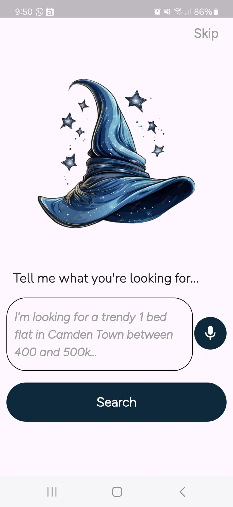
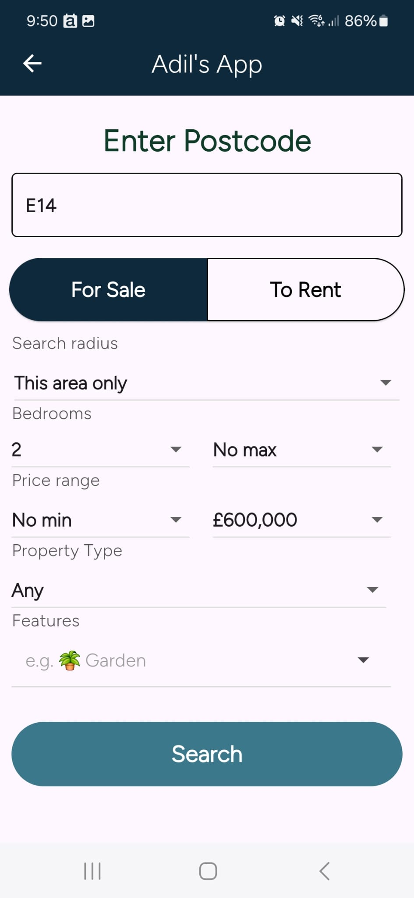
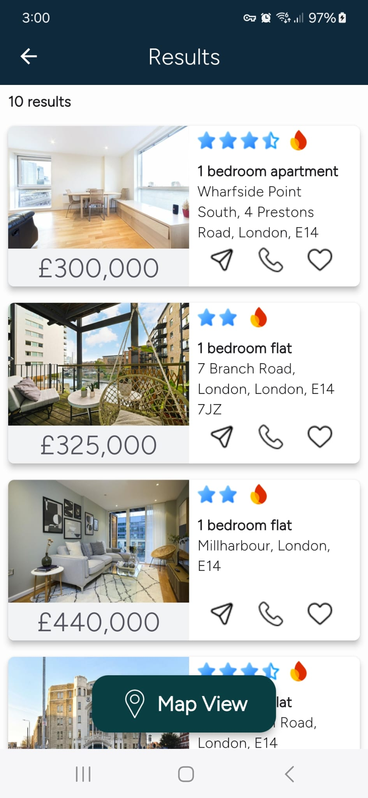
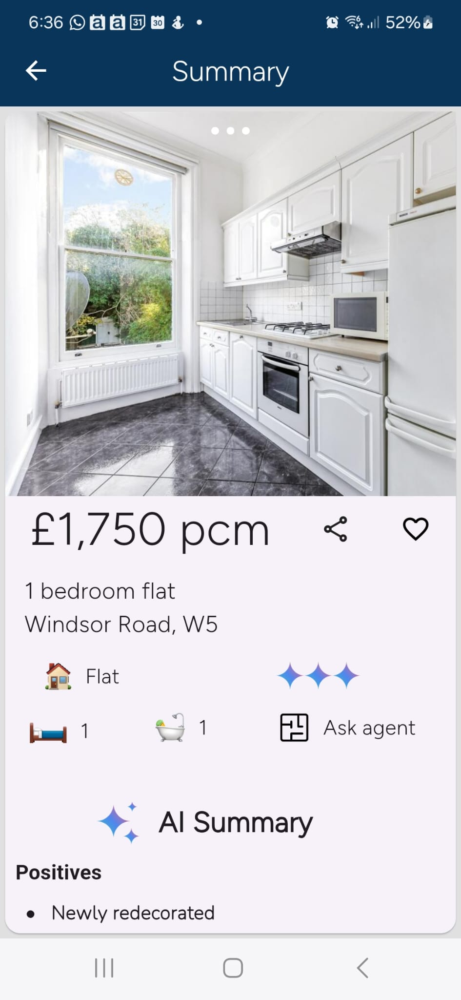
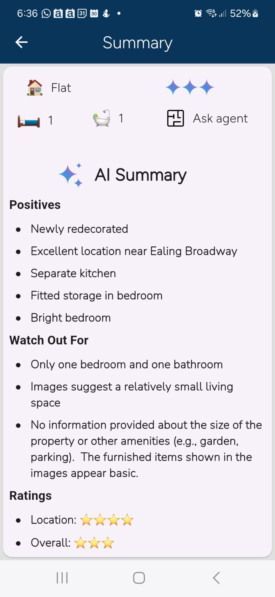

<h1 align="center">
  
   
  Prop&nbsp;AI
</h1>

  <i>Your AI Property Portal</i>

---
✨ Key Features

AI property matchmaker – conversational recommendations powered by Gemini via the google_generative_ai Dart SDK

Interactive maps – pinpoint listings on Google Maps with clustering & custom pins

Smart filters – surface homes by budget, location, number of rooms, amenities & more

Instant insights – on‑the‑fly valuation, rental yield & neighbourhood stats generated with AI

Cross‑platform – one Flutter code‑base targeting iOS, Android, Web, macOS, Windows & Linux

 
  
   
  
   
   

From AI chat to search results and insights – PropAI in action

🧩 Project Structure  
 
lib/  
├── Screens/              # Pages & flows  
├── Widgets/              # Reusable UI pieces  
├── Services/  
│   ├── ai_service.dart  
│   ├── map_service.dart  
│   └── firestore_service.dart  
└── main.dart             # Entry point  
 
assets/                   # Images & Lottie  
firebase/                 # Firestore rules & indexes  

📝 License

Distributed under the MIT License. See LICENSE for details.

